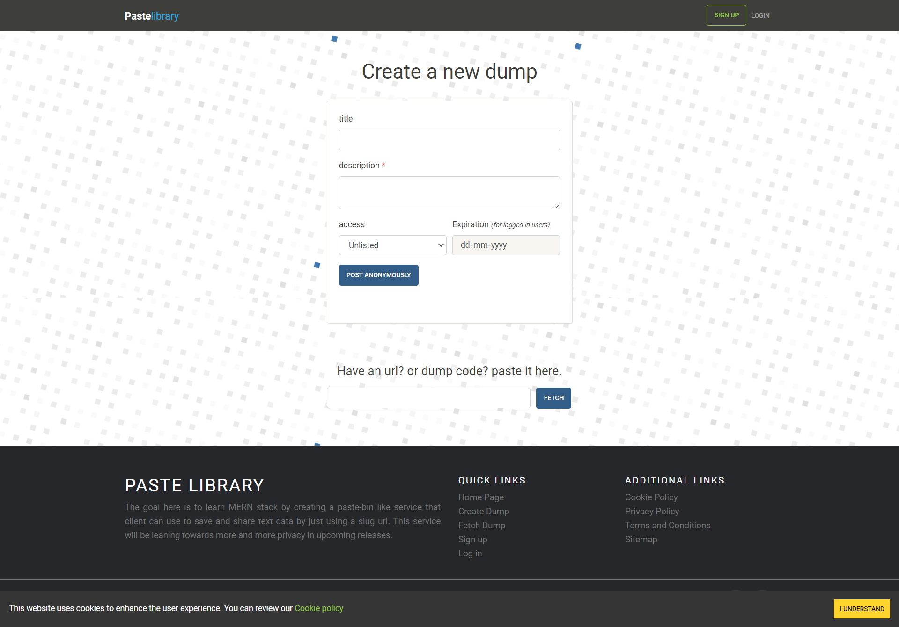
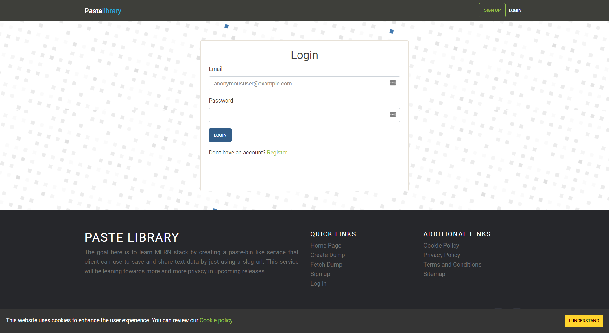
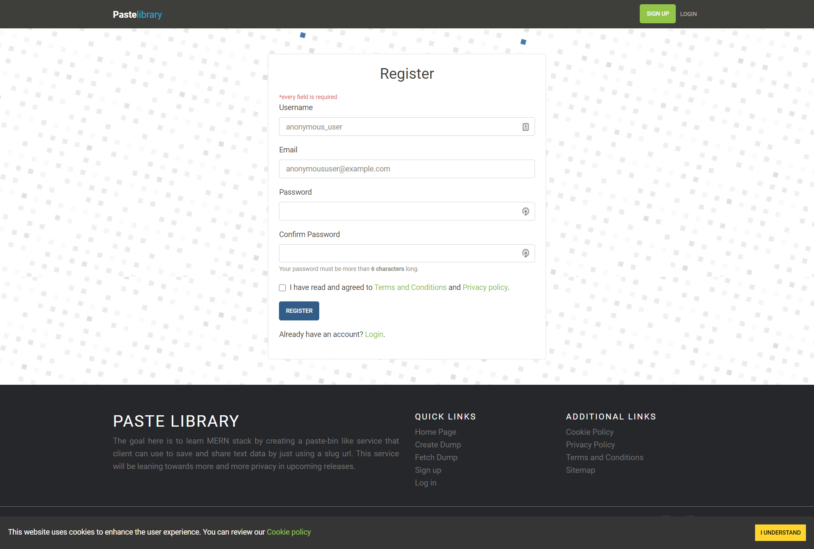
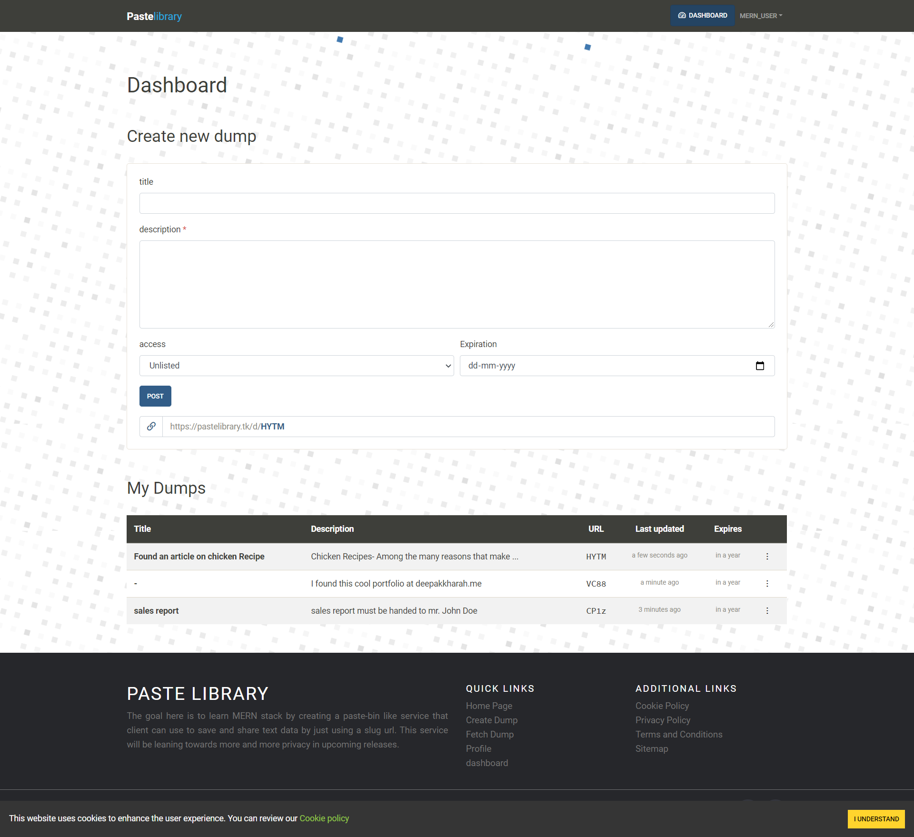
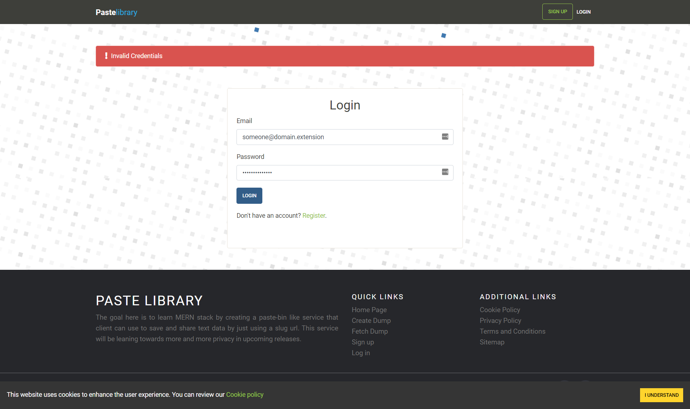

# Contrl CV

[](https://github.com/priyanshpsalian/paste-library-mern)  [](https://contrlcv.tk)

Contrl CV is a web-based paste bin like service that allows users to paste and share text. I made this app to explore the MERN stack. During the development, I learned how to generate and map a short URL to a set of data with the least collision. The aim was to achieve maximum convenience and privacy. So, the metric used was to complete the entire process within just two clicks.

# Table of content

-   [Contrl CV](#paste-library)
-   [Installation](#installation)
-   [Usage](#usage)
-   [Tech stack](#tech-stack)
    -   [Front end](#front-end)
    -   [Backend](#backend)
    -   [Database](#database)
    -   [Server](#server)
-   [Deployment](#deployment)
-   [Screenshots](#screenshots)
-   [License](#license)

# Installation

1. [Fork](https://docs.github.com/en/github/getting-started-with-github/fork-a-repo) the repository, then [clone](https://docs.github.com/en/github/creating-cloning-and-archiving-repositories/cloning-a-repository) from your repository.

2. Create MongoDB server with the username **super** _(!Important)_ from [MongoDB atlas](https://www.mongodb.com/cloud).

3. Make sure you have `node.js` installed on your system. [Download node.js](https://nodejs.org) if required.


    ```sh
    # to check if node.js exist
    $ node -v
    ```

4. Go to the cloned `paste-library-mern` folder in your local machine and open terminal.

5. Enter following command to install dependencies for both backend and frontend

    ```sh
    $ npm install
    $ cd client # paste-library-mern/client
    $ npm install
    $ cd .. # paste-library-mern/
    ```

6. Make a copy of `.env.example` and rename it `.env` in the same directory.

7. Replace `.env` file values except for `DEFAULT_USER_ID`.

8. Run following commands in the terminal to run the web-application.

    ```sh
    # first terminal
    # paste-library-mern/
    $ npm start
    ```

    ```sh
    # second terminal
    $ cd client # paste-library-mern/client
    $ npm start
    ```

    If successful you'll see this msg in the two terminals

    ```sh
    Server started on port 5000
    MongoDB connected
    ```

    ```sh
    Compiled successfully!

    You can now view client in the browser.

    Local:            http://localhost:3000
    On Your Network:  http://192.168.xxx.xxx:3000

    Note that the development build is not optimized.
    To create a production build, use npm run build.
    ```

9. Create new default anonymous user by going to url `localhost:3000/register` with any credentials you like. This will be used for all dump creation for logged out user.

10. Go to your [Atlas dashboard](https://cloud.mongodb.com/) and click on collections now find `users` database and copy `_id`. Now, paste this in `.env > DEFAULT_USER_ID`.
    > Note: copy only the string inside ObjectId()

# Usage

Go to localhost:3000/ to view the project running and use it like any other web-application.



# Tech stack

### Front end

-   HTML
-   CSS
-   ReactJS

### Backend

-   NodeJS
-   ExpressJS

### Database

-   MongoDB

### Server

-   Heroku

# Deployment

This web-application is deployed using [Heroku](https://heroku.com) under the domain [contrlcv.tk](https://contrlcv.tk)

# Screenshots









# License

This web-application is licensed under MIT. For more info refer to [LICENSE](LICENSE) file in the root directory.
